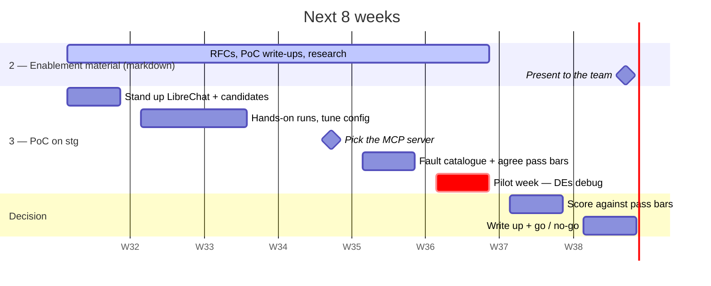

# 8-week plan

Everything here serves one question — **is this worth adopting?** — answered for the supervisor at week 8.

## The three deliverables, in priority order

| | Acceptance criterion | What it actually is | Status |
|---|---|---|---|
| 1 | Written inventory of DE chores with time estimates and agent-suitability assessment, presented to the team | The profiling work that drove the focus decision | ✅ Done |
| 2 | **Enablement material delivered in markdown and presented** | **The RFCs, PoC write-ups and research** — the body of written work | 🔨 Continuous |
| 3 | Working PoC covering at least one focus area | LibreChat + MCP server on stg, if a promising tool holds up | 🔨 Weeks 1–7 |

Deliverable 2 outranks deliverable 3, and deliverable 3 is conditional on a tool proving promising. **If the PoC stalls, the written work still lands and criterion 2 is still met.** The RFCs are the deliverable; the PoC is evidence for them.

## Week by week

| Week | What happens | Output |
|---|---|---|
| 1 | Deploy LibreChat + candidate MCP servers on stg; pin which Kubernetes MCP server | Something running to test against |
| 2–3 | Run the same known failures through each combination; fill the comparison matrix | A **tuned configuration** and the matrix's blank cells filled |
| 4 | Decide the MCP server; finish RFC-2's evaluation half | RFC-2 evaluation complete |
| 5 | Build the fault catalogue; agree pass bars with the team **before** any pilot data exists | Sealed catalogue + agreed Day-0 thresholds |
| 6 | Pilot week — injected faults, DEs debug through the tool, one scorecard per issue | Scorecards |
| 7 | Score the pilot against the Day-0 thresholds | Pass or fail, with the numbers |
| 8 | Write up the recommendation and present the body of work | **Go / no-go to the supervisor** |

RFC writing runs across every one of these weeks — that is deliverable 2, not a task at the end.

## The one gate that matters

Pass bars are agreed in **week 5**, before any pilot data exists. That is what stops them being quietly relaxed in week 7 to fit whatever came back.

- **Pass** → RFC-3: production security, RBAC, rollout.
- **Fail** → name the elimination factor. A well-evidenced *no* answers the epic's question as well as a yes, and deliverable 2 lands either way.

Details in [rfc-2-mcp-server-evaluation.md](rfc-2-mcp-server-evaluation.md).

## Not in these 8 weeks

- **Gen AI for Platform Engineers 101** — the team enablement session (epic task 3). Parked, not dropped.
- **RFC-4** deploying via Argo by MR, **RFC-5** the 90-day traffic baseline, **RFC-6** CPU/memory spike remediation. Mapped and waiting — see [CLAUDE.md](CLAUDE.md).

## What could slip

- **DE availability in week 6.** The pilot needs duty engineers actually running cases. If their week is busy, it slides and everything after it moves.
- **The fault catalogue is on the critical path.** Sealed in week 5 or week 6 has nothing to run.
- **Weeks 2–3 are the flexible part.** If tuning takes longer, take it from there rather than compressing the pilot or the write-up.
