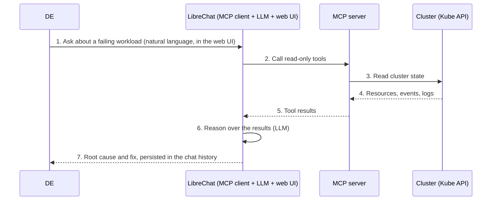

# RFC-1: Adopt LibreChat with an MCP server for DE Kubernetes troubleshooting

| **Metadata** | **Value** |
|---|---|
| **Status** | Draft — to be superseded by the ADR |
| **Authors** | @wenbierrr |
| **Approvers** | TBC |
| **Created** | 2026-08-06 |
| **Last Updated** | 2026-09-10 |

## Change log

| Version | Date | Changes | Author |
|---|---|---|---|
| 1.0 | 2026-08-06 | Initial evaluation of four tool architectures | @wenbierrr |
| 2.0 | 2026-09-10 | Restructured based on `RFC-template.md` | @wenbierrr |

---

## 1. Proposal

This RFC proposes adopting **LibreChat as the orchestrator, backed by an MCP server**, so that a duty engineer can troubleshoot cluster issues conversationally in a web UI, with the exchange persisted and the agent unable to write the cluster.

## 2. Motivation

When a deployment breaks, finding the cause and the fix is time-consuming — and **the duty engineer changes every day**, so whoever is on duty meets the problem cold with no context carried from yesterday. About **90% of real DE issues are networking**, the class that takes longest to trace manually.

Furthermore, DEs keep escalating to Starforge for help, and every escalation costs time on both sides.

### Scope

**In scope:** K8sGPT, kubectl-ai, kagent, and LibreChat + MCP server comparison

**Out of scope:**

- LLM hosting (an inference endpoint is assumed) and model selection
- **Which MCP server pairs with LibreChat**
- Hands-on tuning and measurement with DEs — the DE trial
- Production security: agent definitions, RBAC wiring, rollout — a service-design doc, only if the ADR goes ahead

## 3. Decision criteria

| ID | Requirement | Use case |
|---|---|---|
| C1 | [Must-Have] Read Only Access | An AI solution that can write to cluster is unacceptable and dangerous |
| C2 | [Must-Have] AI usage is auditable | The DE who used it must be identifiable |
| C3 | [Must-Have] Chat history persisted | Post-incident review, and making sense of DE's actions |
| C4 | [Must-Have] Conversational chat | Troubleshooting is a back-and-forth process; more context needs to be sometimes provided to prevent the tool from going down the wrong rabbit hole |
| C5 | [Must-Have] Good UI/UX | Improves DE satisfation and likelihood of using tool |
| C6 | [Must-Have] Few artifacts to install and upgrade | Minimise D1 & D2 overhead |
| C7 | [Should-Have] Cross-namespace reach | ~90% of DE issues are networking, where the symptom sits several hops from the cause |
| C8 | [Should-Have] Runs on any Kubernetes | Enables multi-cloud flexibility |

## 4. Proposed change

**[LibreChat](https://github.com/danny-avila/LibreChat)** is an open-source, self-hostable multi-LLM chat web UI. Recent versions added MCP client support, so it connects to an MCP server and calls its tools.

**This is the one option whose capability is not fixed by the tool itself.** LibreChat supplies the interface, the conversation and the persistence; **the MCP server behind it decides what the LLM can see of the cluster.** Which server that is stays open — LibreChat registers any number of them, so the choice can change later without revisiting this decision.

LibreChat never talks to the cluster and only talks to the MCP server. Thus, it doesnt require any cluster role. The MCP server is the sole component with cluster access, bound to a **read-only ClusterRole**.

## 5. Alternatives considered and rejected

Each driver is split into **Information** (the fact) and **Evaluation metric** (the judgement drawn from it). 

| Decision driver | | 1 · K8sGPT | 2 · kubectl-ai | 3 · kagent | 4 · LibreChat + MCP |
|---|---|---|---|---|---|
| **C1** Blast radius | Information | Read-only by design | **Write-capable** — generates and executes `kubectl` (with DE approval) | **Write-capable by default** | **Read-only by design** — LibreChat holds no cluster credential; the MCP server's ClusterRole is read-only |
| | Evaluation metric | Safe | Safe only if bound to a read-only SA | Safe only if each agent is bound to a read-only SA | Safe |
| **C2** Security (Access Control) | Information | No native app-layer auth or user management | No native app-layer auth or user management | No native app-layer auth or user management | Native multi-user auth |
| | Evaluation metric | no access control | no access control | possible to implement using an external auth layer (e.g., OAuth2-Proxy) | High |
| **C3** Auditability | Information | CLI path persists nothing | Ephemeral terminal session | Postgres persists history; OTEL can trace agent actions | MongoDB persists history |
| | Evaluation metric | None | None | High | High |
| **C4** Conversational Chat | Information | One-time scan, no chat | Interactive session | Agent loop plus chat | Full conversation with context |
| | Evaluation metric | None | High | High | High |
| **C5** UI/UX | Information | Terminal session only | Terminal session only | Dedicated web chat UI | Full web chat GUI |
| | Evaluation metric | Low | Low | High | High |
| **C6** Day 1 — install | Information | `helm install` | `helm install` — no official chart, so a custom one is built and maintained in-house | kagent-crds chart (type definitions) + kagent chart: controller, UI, bundled Postgres | MCP server chart + LibreChat chart (LibreChat, MongoDB, Meilisearch) |
| | Evaluation metric | Low — one chart | Low — one chart | Med — 2 charts | Med — 2 charts |
| **C6** Day 2 — operate | Information | `helm upgrade` | `helm upgrade` | `helm upgrade` | `helm upgrade` |
| | Evaluation metric | Low — one release | Low — one release | Med — 2 releases | Med — 2 releases |
| **C6** Additional chores | Information | Maintain a Dockerfile — patch to clear 2 High CVEs | Maintain a Helm chart (not official) + Dockerfile — patch to clear 1 Critical CVE | Many bugs when trialing (alpha version) | LibreChat itself needs only a values change + whatever the chosen MCP server require |
| | Evaluation metric | Low — one artifact | Med — two artifacts | High | Low — one artifact |
| **C7** Cross-namespace debugging | Information | Sees every namespace, follows none — no kubectl, so a lead pointing out of the namespace is a dead end | Follows anywhere — generates a read command for any namespace | Follows the dependency chain itself, across namespaces | Follows a lead wherever the MCP server's tools reach |
| | Evaluation metric | None | High | High | High and also dependent on the MCP server chosen |
| **C8** Runs on any Kubernetes | Information | Any Kubernetes | Any Kubernetes | Any Kubernetes | Any Kubernetes |
| | Evaluation metric | High | High | High | High |

### Alternative: K8sGPT alone

- **What it is:** a scanner, not an assistant. Its fixed analyzers scan resources read-only and need no LLM. An LLM is involved only if the OPTIONAL `--explain` flag is passed.
- **Different flavours:** the same analyzers ship behind three surfaces.
  1. **CLI** (`k8sgpt analyze`) — findings printed to the terminal, nothing kept.
  2. **Operator** — runs on an interval and writes each finding as its own `Result` CR, so one root cause surfaces as many separate problems.
  3. **MCP server** (`k8sgpt serve --mcp`) — the same analyzers exposed as callable tools for an LLM.

  Whichever surface is used, the output is the same: independent symptoms, with no diagnosis and no correlation between them.
- **Why rejected:**
  - **Fails C2** — a CLI binary with no user management, so there is no record of who ran it.
  - **Fails C3** — the CLI persists nothing.
  - **Fails C4** — one scan, then it stops. There is no second question to ask.
  - **Fails C5** — terminal only.

  Its findings only become useful once an LLM reasons over them, which is exactly what the proposed LibreChat + MCP server architecture supplies. K8sGPT is therefore a candidate MCP server rather than a competing architecture.

### Alternative: kubectl-ai

- **What it is:** [kubectl-ai](https://github.com/GoogleCloudPlatform/kubectl-ai) turns natural language into `kubectl` commands in an interactive terminal session.
- **How it would work here:** every question runs through a four-step loop.
  1. The DE describes the problem in natural language.
  2. The LLM proposes a `kubectl` command.
  3. The DE approves or rejects it.
  4. IF approved, kubectl-ai runs the approved command and feeds the output back to the LLM for interpretation.

- **Why rejected:**
  - **Fails C2** — a CLI binary with no user management, so there is no record of who ran it.
  - **Fails C3** — the terminal session is ephemeral; nothing is properly persisted.
  - **Fails C5** — terminal only.
  - **Weakest on C6** — two artifacts built from scratch and maintained in-house, against a project with no regular update cadence.

### Alternative: kagent

- **What it is:** [kagent](https://github.com/kagent-dev/kagent) is a full agentic platform, and the only candidate that drives a multi-step investigation on its own. Agents are defined as Kubernetes resources and can call one another, so one agent gathers evidence while another reasons over it, looping until it reaches a root cause and a suggested fix.
- **How it would work here:** two Helm charts, deployed in order.
  1. **`kagent-crds`** — the type definitions only, no pods.
  2. **`kagent`** — the controller, the web UI and a bundled Postgres.

  Each agent is then defined as an `Agent` resource and binds its own ServiceAccount.
- **Why rejected:**
  - **Pre-1.0, and not reliable enough for the org (no-go criteria)** kagent is still alpha at 3.4k stars, the least proven of the four. Trialling it surfaced many bugs, and an alpha platform sitting in the DE troubleshooting path is a risk the org will not accept.
  - **Fails C6** — an entire agentic platform in the cluster: CRDs, a controller, a UI and a Postgres. Too much overhead as we need to develop and maintain the agent-to-agent orchaestration.

## 6. Verdict

**Verdict:** Adopt **LibreChat with an MCP server** — the only candidate that meets all six Must-Haves.

K8sGPT and kubectl-ai are both command-line tools: no access control, no history kept, and no UI a less-experienced DE would reach for. kagent has all three, but it is still alpha, and running an unproven platform in the DE troubleshooting path is a risk the org will not accept. LibreChat is the only option that meets every Must-Have, and the MCP server behind it can be changed without reopening this decision.

**Revisit if:** Intelligence from agent-to-agent multi orchaestration is needed

## 7. Impact

| | |
|---|---|
| **Who is affected** | Duty Engineers |
| **What gets deployed** | Two Helm releases per cluster: LibreChat, and the chosen MCP server |
| **Rollback** | `helm uninstall` both releases. The tool cannot write to cluster, so there is no state to unwind |
| **Effort** | Trial on 13 DEs. For each DE, they are given 3 commonly faced problems, with minimal overlaps. |
| **Baseline compliance** | **RBAC** — the MCP server binds a read-only ServiceAccount with Secrets excluded from its read access; LibreChat needs no cluster role |
