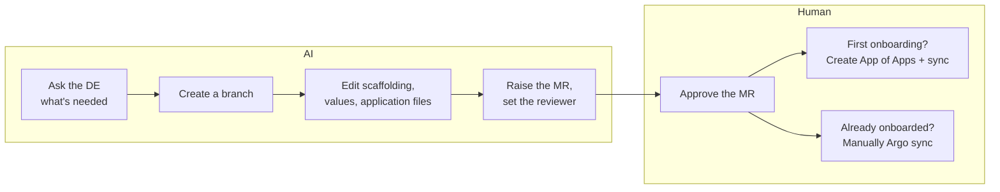

# RFC-2: Evaluating which MCP server(s) to pair with LibreChat

> **Status: in progress.** Findings land weeks 1–5; this document is written from them in weeks 6–8. Blank cells are waiting on evidence, deliberately.

## Table of contents

1. [Motivation](#motivation)
2. [Scope](#scope)
3. [Brief overview of the MCP servers](#brief-overview-of-the-mcp-servers)
4. [Options considered](#options-considered)
   - [Kubernetes MCP server](#kubernetes-mcp-server)
   - [k8sgpt MCP server](#k8sgpt-mcp-server)
   - [Argo MCP server](#argo-mcp-server)
   - [GitLab MCP server — the deploy path](#gitlab-mcp-server--the-deploy-path)
   - [Prometheus-compatible MCP server](#prometheus-compatible-mcp-server)
5. [Comparison matrix](#comparison-matrix)
6. [How this gets decided](#how-this-gets-decided)

## Motivation

[RFC-1](rfc-1-ai-tool-evaluation.md) narrowed four tools to one architecture — **LibreChat as the orchestrator** — and deliberately left open what sits behind it.

That gap is the whole question here. LibreChat supplies the interface, the conversation and the persistence; **the MCP server behind it decides what the LLM can actually see and do.** The DE-facing experience is identical either way; the ceiling is not.

**This RFC answers one question: LibreChat + which combination of MCP servers brings DEs the most value?**

Value is judged against three outcomes the decision-makers care about:

1. **Prompt, then prepare the deployment** — from a chat request to a raised MR.
2. **Show the blind spots of the OpenShift CPU/memory dashboards** — determine what X is, and once X is exceeded, give the steps that stop the bleeding and stop it recurring.
3. **A less-experienced DE says it was useful** — not a senior DE, not the author.

These are the yardstick, not a checklist. If a combination does not naturally address one, that is the finding — record it. A contorted claim that a combination "sort of" meets a point is worth less than a clean no.

## Scope

**In scope:**
- Which MCP server(s) back LibreChat — k8sgpt, Kubernetes, Argo, GitLab, a Prometheus-compatible server, or some combination
- The three DE problem areas they are tested against: troubleshooting (1.1.1–1.1.3), deploying (1.1.4), and the CPU/memory threshold work (2.2)
- Hands-on runs on stg, then a DE rollout scored against pass bars agreed beforehand

**Out of scope:**
- The orchestrator — settled in [RFC-1](rfc-1-ai-tool-evaluation.md)
- **Direct cluster writes by the agent, and AI-triggered Argo syncs.** Not a trade-off being weighed — a standing rule
- Hosting of the LLM (an inference endpoint is assumed) and which model to use
- Production security design (agent definitions, RBAC wiring, rollout plan) — RFC-X, and only if the pilot passes

## Brief overview of the MCP servers

|  | k8sgpt | Kubernetes | Argo | GitLab | Prometheus-compatible |
|---|---|---|---|---|---|
| **Why it was built** | Encode SRE checks as code | Give an LLM kubectl's reach | Let an agent read and drive Argo apps | Let an agent work a GitLab repo | Let an agent query PromQL |
| **Maturity (as of 6/8/26)** | part of k8sgpt (CNCF, 8k stars) | `containers/kubernetes-mcp-server` — 66 releases, ~every 10–17 days, still pre-1.0 | `argoproj-labs/mcp-for-argocd` — 16 releases, ~monthly, v0.8.0 | Official, ships in GitLab 18.5+ | `pab1it0/prometheus-mcp-server` — **v1.6.2, the only post-1.0 candidate** |
| **What it adds** | Curated, deterministic analyzer findings | Read reach across every namespace | `OutOfSync`, failed hooks, drift | Branch, file edits, create MR with reviewer | Instant + **range** PromQL against Thanos |
| **What is lost** | Any lead outside an analyzer's remit — and **no tool writes anything** | The curated checks; Istio CRDs are opaque resources | Everything but Argo state | Any cluster visibility | Any cluster object state |

## Options considered

**Not a menu — an order of investigation.** Each server is added only if the one before left something unreached, so the winning combination is the smallest that earns its keep:

**Kubernetes** → **k8sgpt** *(only if it earns its place)* → **Argo** → **GitLab** → **Prometheus-compatible**

### Kubernetes MCP server

**What it is:** read verbs — get, describe, logs, events — exposed as tools, giving the LLM kubectl's reach through a chat UI. The starting point, and expected to cover most of 1.1.2 alone.

- **Gains:** can follow a lead anywhere in the cluster without a fixed analyzer having anticipated the failure mode.
- **Loses:** curated checks. Every diagnosis rests on the LLM reasoning from raw state, which raises the wrong-but-plausible risk.
- **On writes:** [`containers/kubernetes-mcp-server`](https://github.com/containers/kubernetes-mcp-server) gates `resources_create_or_update` and `resources_delete` behind `--enable-create` / `--enable-update` / `--enable-delete`, **all defaulting to false. They stay false.**

> **Istio.** Neither this nor k8sgpt reaches Istio config — a general server sees Istio CRDs only as opaque resources. Given the fault catalogue is networking-weighted, a read-only Istio MCP server (e.g. [`krutsko/istio-mcp-server`](https://github.com/krutsko/istio-mcp-server)) may be needed to reach 1.1.3 at all. Decided by the 1.1.3 fault cases.

### k8sgpt MCP server

**What it is:** `k8sgpt serve --mcp` exposes K8sGPT's fixed analyzers as callable tools — deterministic scans the LLM then correlates.

- **Gains:** curated SRE checks maintained upstream as code; read-only by design, so the RBAC story is one read-only ServiceAccount.
- **Loses:** everything outside an analyzer's remit. If a finding points at an upstream Service, the LLM cannot go look at it.
- **Confirmed surface:** **12 tools** — `analyze`, `cluster-info`, `list-resources`, `get-resource`, `list-namespaces`, `get-logs`, `list-events`, `list-filters`, `add-filters`, `remove-filters`, `list-integrations`, `config`. Ten read cluster state; the rest change k8sgpt's own settings. **None create, apply, patch or delete anything.** ([MCP.md](https://github.com/k8sgpt-ai/k8sgpt/blob/main/MCP.md))
- **The open question:** whether it earns its place *on top of* the Kubernetes MCP server. If step 1 already answers the cases, say so and drop it — a second artifact has to pay for itself.

### Argo MCP server

**What it is:** [`argoproj-labs/mcp-for-argocd`](https://github.com/argoproj-labs/mcp-for-argocd). **Only its read tools are used.**

- **The job — 1.1.1 diagnosis.** *Workload cannot be synced on Argo* is the one failure class whose evidence may not exist in Kube API state at all: an app stuck `OutOfSync`, a failed hook, or drift.
- **Decision rule:** justified only if the 1.1.1 fault cases prove unreachable without it. Many sync failures leave a visible Kube API symptom, in which case an extra artifact is not worth its upkeep.
- **It is not the deploy path.** Its `sync` and `create`/`update` tools exist but go unused — a sync-capable token is the one credential here that could change what runs, and the agent does not hold it.

### GitLab MCP server — the deploy path

**What it is:** the [official GitLab MCP server](https://docs.gitlab.com/user/model_context_protocol/mcp_server_tools/) (18.5+), whose create-merge-request tool takes description, reviewers, assignees and labels. This is how "prompt, then deploy" is satisfied — entirely through git, with no cluster access at all.

Everything downstream of the MR is a person. That is what makes an AI-authored deployment acceptable: a human verifies correctness before anything reaches OCP, and the MR is its own audit trail — author, reviewer, approver, diff.

*Why not a cluster write:* an agent that applies a fix directly creates drift Argo reverts, so the fix silently disappears — the worst failure mode to demonstrate to a decision-maker.

### Prometheus-compatible MCP server

**What it is:** instant and **range** PromQL queries against the OpenShift monitoring stack. The range query is what makes winner point 2 possible at all — determining X needs history, not an instant value.

- **Nothing else in this list reaches metrics.** Without it, winner point 2 is unreachable whatever else is installed.
- **How to reach the data:** Observe → Dashboards reads the **Thanos Querier**. Programmatic access is the `thanos-querier` route in `openshift-monitoring`, **bearer token only**, via a ServiceAccount bound to `cluster-monitoring-view`. Red Hat advises ≤ 1 query per 30s.

> **Watch item — Red Hat's own server.** [`openshift/openshift-mcp-server`](https://github.com/openshift/openshift-mcp-server) bundles core cluster tools, PromQL against Thanos, Kiali for the mesh and NetEdge for DNS/ingress in one vendor-backed artifact — and it is a fork of `containers/kubernetes-mcp-server`, so the core is the same code. **It has zero tagged releases and is developer preview**, consumable only from `main` or a commit SHA, which makes "we tested X" unverifiable. Not adopted for that reason. **Re-check on first tagged release, or GA.**

## Comparison matrix

Same shape as [RFC-1's matrix](rfc-1-ai-tool-evaluation.md#comparison-matrix): each driver split into **Information** (the fact) and **Evaluation metric** (the judgement drawn from it).

**Cells are blank until tested.** A blank means "not yet established" — filling it with a plausible guess would defeat the point of running the work below.

| Decision driver | | Kubernetes | + k8sgpt | + Argo | + GitLab | + Prometheus |
|---|---|---|---|---|---|---|
| **Prompt → raised MR** (winner 1) | Information | None | None | Read-only, no deploy role | Create MR with reviewer | None |
| | Evaluation metric | None | None | None | **The only path** | None |
| **Dashboard blind spots** (winner 2) | Information | No metrics access | No metrics access | No metrics access | No metrics access | Instant + range PromQL vs Thanos |
| | Evaluation metric | None | None | None | None | **The only path** |
| **Less-experienced DE finds it useful** (winner 3) | Information | | | | | |
| | Evaluation metric | | | | | |
| **1.1.2 — pod down / app broken** | Information | Full read reach | Curated analyzers on top | N/A | N/A | N/A |
| | Evaluation metric | | | N/A | N/A | N/A |
| **1.1.1 — Argo sync failure** | Information | Resulting symptoms only | No analyzer targets sync state | Directly targets it | N/A | N/A |
| | Evaluation metric | | | | N/A | N/A |
| **1.1.3 — Istio config** | Information | CRDs opaque | No Istio analyzers | N/A | N/A | N/A |
| | Evaluation metric | Low | None | N/A | N/A | N/A |
| **Tool-selection reliability** | Information | Single surface | Overlapping surfaces — untested | +1 surface | +1 surface | +1 surface |
| | Evaluation metric | High | | | | |
| **Day 1 / Day 2 cost** | Information | 1 image + chart | +1 image (2 High CVEs to patch) | +1 image, +API token | in-product, no artifact | +1 image, +SA token |
| | Evaluation metric | Low | Med | Med | Low | Med |
| **RBAC / credentials** | Information | Read verbs, scope deliberately | Read-only by design | Read-only Argo token | GitLab token, no cluster access | SA with `cluster-monitoring-view` |
| | Evaluation metric | Safe if scoped | Safe | Safe | Safe | Safe |
| **Pinnable to a release** | Information | 66 releases, pre-1.0 | tracks k8sgpt | 16 releases, v0.8.0 | product train | **v1.6.2, post-1.0** |
| | Evaluation metric | Med | Med | Med | High | High |

**Verdict:** *pending — weeks 6–8.*

## How this gets decided

### Weeks 1–3 · hands-on runs on stg

Familiarisation and tuning, **not evidence**. The cases are few, whoever runs them already knows the root cause, and they are invested in the outcome — so nothing here belongs in the decision memo as proof of value. Its output is the tuned configuration the pilot runs on, and the answer to which server saw what.

Re-run the **same** cases against each combination: the cases are the constant, the server is the variable. Log the version and config in force for every run.

| # | Combination | Pod (down) | Namespace | Root cause | Time | Found? | Hallucination? |
|---|---|---|---|---|---|---|---|
| 1 | + k8sgpt | starline-harmony-db-nsc-stg-1 | harmony-db | cannot create lock file — insufficient storage assigned | 10 min | Y | N |
| 2 | + k8sgpt | crossbeam-mi-source-1 | crossbeam-mi | no network policy allowing source → broker | 20 min | Y | N |
| 3 | + k8sgpt | media-processor-6f… | starlake-media-processor | cannot reach schema registry's service | | | |

### Weeks 4–5 · DE rollout

**This is where evidence starts.** Faults are **injected, not waited for** — a one-week window will not produce enough organic failures, and if nothing breaks the DEs have no reason to reach for the tool at all.

*Fault catalogue* — ~80% networking, matching the ~90% real-world figure. Answer key sealed until each case closes.

| Layer | Faults | Sub-area |
|---|---|---|
| K8s networking | NetworkPolicy blocks egress · Service selector matches no pods · `targetPort`/`containerPort` mismatch · wrong cross-namespace FQDN | 1.1.2 |
| Istio networking | sidecar not injected · AuthorizationPolicy denies caller · PeerAuthentication STRICT vs plaintext client · VirtualService routes to an undefined subset | 1.1.3 |
| Control (~20%) | missing Secret/ConfigMap · OOMKilled · Argo app `OutOfSync` / failed hook | 1.1.2, 1.1.1 |

*Injection rules — these are what make the result worth anything:* faults must be multi-hop, not one-glance · the injector holds the sealed key and does not score · DEs are not told which failures are injected · the same catalogue runs against every combination.

*One scorecard per issue:* DE experience level · sub-area · root cause found (full/partial/no/**wrong**) · hallucination Y/N · time to root cause · rough time without the tool · would this have been escalated? · route reached (diagnosis / change drafted / MR raised).

### Pass bars — agreed Day 0, before any data exists

A proposal to be edited and agreed by the team. Fixed pre-data so they cannot be quietly relaxed later to fit a result.

| Metric | Pass bar | Why |
|---|---|---|
| **Sample size** | **n ≥ 8** | Settle first — every percentage depends on it. At n=3 a percentage is noise |
| Root cause found (full or partial) | ≥ 70% | Below ~two-thirds a DE cannot justify reaching for it first |
| **Wrong** root cause | ≤ 1 case, none costing >15 min | Scored apart from "no answer" — a confident wrong answer is the expensive failure |
| Hallucination | 0 | In a sample this small, one ungrounded claim is a signal, not noise |
| **Less-experienced DE** says useful | ≥ 4 of every 5 cases they ran | A senior DE's approval does not satisfy winner point 3 |
| Escalation to Starforge avoided | ≥ 30% of cases they'd otherwise escalate | Countable with zero historical data — the strongest metric here |
| Reached a raised MR end-to-end | ≥ 1 case | One clean demonstration beats a capability claim |
| DE-estimated time saved | **Report only — no bar** | An estimate must not gate a decision |

**What this method cannot show:** injected faults are cleaner than organic ones · the injector knows the answer · drill urgency is not incident urgency · at n ≥ 8 the percentages are directional, not statistical · it measures stg, not prd.

### End of the pilot — go / no-go

- **Pass** → RFC-X: production security, RBAC wiring, rollout.
- **Fail** → name the elimination factor, and whether it is fixable (prompt tuning, a different server) or fundamental.

A fail that names its elimination factor is a result, not a dead end. The epic asks "is this worth adopting" — a well-evidenced *no* answers it.
