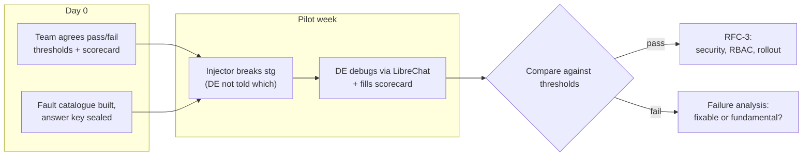

# RFC-2: Evaluating which MCP server(s) to pair with LibreChat

## Table of contents

1. [Motivation](#motivation)
2. [What would convince the decision-makers](#what-would-convince-the-decision-makers)
3. [Scope](#scope)
4. [Options considered](#options-considered)
   - [LibreChat + K8sGPT MCP server](#librechat--k8sgpt-mcp-server)
   - [LibreChat + Kubernetes MCP server](#librechat--kubernetes-mcp-server)
   - [LibreChat + both](#librechat--both)
   - [Argo MCP server — diagnosis and the deploy path](#argo-mcp-server--diagnosis-and-the-deploy-path)
5. [Comparison matrix](#comparison-matrix)
6. [Testing on stg](#testing-on-stg)
7. [Rollout to DEs — a one-week pilot](#rollout-to-des--a-one-week-pilot)
   - [The fault catalogue](#the-fault-catalogue)
   - [Proposed pass bars](#day-0--fix-the-bar)
   - [What this method cannot show](#what-this-method-cannot-show)

## Motivation

[RFC-1](rfc-1-ai-tool-evaluation.md) narrowed four tools down to one architecture: **LibreChat as the orchestrator**, chosen for its web GUI, persisted multi-user chat history, and the absence of any disqualifying gap. That verdict settled the orchestrator and deliberately left the MCP server open.

The MCP server is not a detail. LibreChat contributes the interface, the conversation, and the persistence — but **the MCP server behind it decides what the LLM can actually see of the cluster**. The DE-facing experience is identical either way; the diagnostic ceiling is not.

The choice has a cost on both sides:

- **Under-serve it** and the agent reasons over a partial cluster. This is exactly the weakness RFC-1 recorded against its k8sgpt-backed reference implementation: the LLM sees only what the fixed analyzers emit, and cannot chase a lead past them.
- **Over-serve it** and tool selection gets noisy — two servers exposing overlapping tools give the LLM more ways to pick the wrong one — while the RBAC surface and the number of maintained artifacts both grow.

This RFC picks the point between those, then does the hands-on work RFC-1 deferred: [known failures on stg](#testing-on-stg) to learn how each combination behaves and how it should be configured, then [DEs' hands for a week](#rollout-to-des--a-one-week-pilot) to find out whether any of it helps.

## What would convince the decision-makers

Two outcomes would count as a clear win. They are stated here up front because they shape what gets built and measured — not appended at the end as a write-up exercise.

**1. It can prompt, then deploy.** Going from a diagnosis to the fix actually landing, driven from the chat. This is the criterion RFC-1's matrix never scored, and it is the one that most constrains the MCP server choice: [k8sgpt's MCP server exposes no tool that writes cluster state](#librechat--k8sgpt-mcp-server), so the winning combination cannot satisfy this on k8sgpt alone.

**Deploy here means the GitOps route.** This is a standing constraint, not a preference for this RFC: **the agent does not write to the cluster.** Argo CD is the source of truth, so the demonstrable paths are an **Argo application sync/update** or a **raised MR** — the change goes through git and Argo applies it, exactly as a human change would.

**2. A less-experienced DE says it was useful.** Not a senior DE, and not the RFC author: the value proposition is that the agent lifts someone who does not already know where to look. Measured through the [pilot](#rollout-to-des--a-one-week-pilot), against [pass bars agreed beforehand](#day-0--fix-the-bar).

## Scope

**In scope:**
- Which MCP server(s) back LibreChat — K8sGPT, a Kubernetes MCP server, both, or an added Argo MCP server
- Whether the combination can go from diagnosis to a deployed fix **via Argo sync or an MR**
- Hands-on runs against known failures on stg — to build a baseline understanding of each combination's behaviour and work out how it should be configured
- Measuring it with DEs over a one-week pilot, against thresholds agreed beforehand

**Out of scope:**
- The client choice — settled in [RFC-1](rfc-1-ai-tool-evaluation.md)
- **Direct cluster writes by the agent** (`kubectl apply`/`patch`/`delete`). Not a trade-off being weighed — a standing rule. Write-capable Kubernetes MCP servers exist and gate these behind opt-in flags; those flags stay off. The deploy criterion is tested through Argo and git instead
- Hosting of the LLM (an inference endpoint is assumed to be provided)
- Which LLM model to use
- Production security design (agent definitions, RBAC wiring, rollout plan) — RFC-3, and only if the pilot passes

## Options considered

All four share the same front end: LibreChat, its web UI, and MongoDB-persisted chat history. Only the tools exposed to the LLM differ.

### LibreChat + K8sGPT MCP server

**What it is:** `k8sgpt serve --mcp` exposes K8sGPT's fixed analyzers as callable tools. The LLM asks for an analysis; the analyzers scan read-only and return findings; the LLM correlates them into a diagnosis.

- **Gains:** curated SRE checks maintained upstream as code, deterministic findings, read-only by design — the RBAC story is a single read-only ServiceAccount.
- **Loses:** everything outside an analyzer's remit. There is no way to chase a lead — if a finding points at an upstream Service, the LLM cannot go look at it.
- **Artifacts:** the K8sGPT Dockerfile (patched for its 2 High CVEs) + a values change on the LibreChat chart.

**Confirmed tool surface.** The MCP server exposes **12 tools** — `analyze`, `cluster-info`, `list-resources`, `get-resource`, `list-namespaces`, `get-logs`, `list-events`, `list-filters`, `add-filters`, `remove-filters`, `list-integrations`, `config`. Ten read cluster state; the two filter tools and `config` change K8sGPT's own analyzer settings. **None create, apply, patch, or delete a Kubernetes resource.** ([MCP.md](https://github.com/k8sgpt-ai/k8sgpt/blob/main/MCP.md))

This is the fact that decides criterion 1: on k8sgpt alone the agent can diagnose but never deploy, and no configuration changes that.

### LibreChat + Kubernetes MCP server

**What it is:** a general-purpose Kubernetes MCP server exposing read verbs — get, describe, logs, events — as tools. Functionally this gives the LLM kubectl's reach through a chat UI, which is what kubectl-ai offered before RFC-1 eliminated it on interface grounds.

- **Gains:** can follow a lead anywhere in the cluster, across namespaces, without a fixed analyzer having anticipated the failure mode. This is the capability RFC-1's reference implementation lacked.
- **Loses:** the curated SRE checks. Every diagnosis is reasoned from raw resource state, so quality rests entirely on the LLM rather than on encoded checks — which raises the wrong-but-plausible risk the evaluation criteria weigh most heavily.
- **Artifacts:** one MCP server image + chart, plus a read-only ServiceAccount whose verbs need scoping deliberately (the tool surface is broad by nature).

**On write capability.** These servers generally *can* write — [containers/kubernetes-mcp-server](https://github.com/containers/kubernetes-mcp-server) exposes `resources_create_or_update` and `resources_delete` behind `--enable-create`, `--enable-update` and `--enable-delete`, **all defaulting to false**. They stay false: the agent does not write to the cluster. Enabling them would also create state Argo CD did not put there, which Argo then reverts.

> **Open:** the specific implementation is not yet pinned. Pin it before scoring — the matrix below is not meaningful against a hypothetical server.

> **Istio.** k8sgpt ships no Istio analyzers and a general Kubernetes MCP server sees Istio CRDs only as opaque resources. Given the pilot is deliberately networking-weighted, a read-only Istio MCP server — e.g. [krutsko/istio-mcp-server](https://github.com/krutsko/istio-mcp-server), covering VirtualService, DestinationRule, Gateway, Envoy proxy config, `istioctl analyze` and `proxy-status` — may be needed to reach sub-area 1.1.3 at all. Carried as a candidate; decided by the [1.1.3 fault cases](#the-fault-catalogue).

### LibreChat + both

**What it is:** both servers registered with LibreChat at once. K8sGPT supplies the opening findings; the Kubernetes MCP server lets the LLM chase them.

- **Gains:** the pairing each option lacks alone — encoded checks *and* the reach to follow what they surface. On paper this is the strongest diagnostic ceiling of the three.
- **Loses:** simplicity, in two distinct ways. Two artifacts to maintain and upgrade rather than one; and overlapping tool surfaces (both can report pod state) which give the LLM room to pick badly, waste turns, or produce inconsistent accounts of the same resource.
- **Verify, do not assume:** that the combination outperforms either alone is a hypothesis. It is the one this RFC most needs to test, because it is the option whose extra cost is certain and whose extra benefit is not.

### Argo MCP server — diagnosis and the deploy path

An **add-on to whichever option wins, not a peer option** — it sits alongside the servers above rather than replacing them. It carries two separate jobs, and the second is the stronger justification.

[`argoproj-labs/mcp-for-argocd`](https://github.com/argoproj-labs/mcp-for-argocd) exposes list, filter, get, create, update, delete and **sync** on Argo applications, plus resource trees, managed resources, workload logs and events.

**Job 1 — diagnosis (sub-area 1.1.1).** *Workload cannot be synced on Argo* is the one failure class whose evidence may not exist in Kube API state at all: an app stuck `OutOfSync`, a failed sync hook, or drift is Argo-side state that neither K8sGPT's analyzers nor a Kubernetes MCP server can see.

*Decision rule:* justified on this job alone only if the [1.1.1 fault cases](#the-fault-catalogue) prove unreachable without it. Many sync failures do leave a visible Kube API symptom, in which case a third artifact is not worth its upkeep for diagnosis alone.

**Job 2 — the deploy path ([criterion 1](#what-would-convince-the-decision-makers)).** This is what makes it a candidate regardless of how job 1 resolves.

Argo CD is the source of truth for what runs in the cluster. That makes "prompt then deploy" mean one of exactly two things here:

| Route | What it is | Trade-off |
|---|---|---|
| **Argo application sync / update** | The agent triggers a sync, or updates the app, through the Argo MCP server | Works with GitOps rather than against it. But an app updated outside git is still drift unless the change went to git first |
| **Raise an MR** | The agent proposes the manifest change as an MR; the existing review and Argo pipeline does the rest | Fully GitOps-native and fully auditable — the MR *is* the audit trail, and review is the guardrail. Slower, and needs a GitLab MCP server or equivalent |

What is **not** an option is the agent writing to the cluster directly. That is drift, Argo reverts or fights it, and the fix silently disappears — the worst possible failure mode to demonstrate to a decision-maker.

*Recommendation:* test the **MR route** first. It satisfies criterion 1, needs no write access to the cluster at all, and its blast radius is a merge request someone has to approve — which turns the hardest gate criterion (blast radius, auditability) into an easy answer rather than an open risk.

## Comparison matrix

Same shape as [RFC-1's matrix](rfc-1-ai-tool-evaluation.md#comparison-matrix): each driver split into **Information** (the fact) and **Evaluation metric** (the judgement drawn from it).

Cells are **left blank until tested**. A blank cell means "not yet established", which is a legitimate state for a live RFC — filling it with a plausible guess would defeat the point of running the tests below.

The last column is the Argo MCP add-on, scored on what it contributes **on top of** whichever base option wins — not as a standalone.

| Decision driver | | + K8sGPT MCP | + Kubernetes MCP | + Both | + Argo MCP (add-on) |
|---|---|---|---|---|---|
| **Acting on a diagnosis** — can it go from finding to deployed fix, and by what route | Information | **None.** 12 tools, none write cluster state | Write tools exist but stay disabled — direct writes are drift | Same as its parts | `sync` / update on Argo apps; MR route via git | 
| | Evaluation metric | None | None (by choice) | None (by choice) | **The only native path** |
| **Istio-layer visibility** — sub-area 1.1.3, and most of the networking faults | Information | No Istio analyzers | Istio CRDs visible only as opaque resources | Same | Argo sees app health, not mesh config |
| | Evaluation metric | None | Low | Low | None — needs a separate Istio MCP server |
| **Coverage of the 1.1 sub-areas** — 1.1.1 Argo sync, 1.1.2 pod down / app broken, 1.1.3 Istio config | Information | No analyzer targets Argo sync state directly | | | Directly targets 1.1.1 |
| | Evaluation metric | | | | |
| **Ability to chase a lead beyond fixed analyzers** | Information | None — bounded by the analyzer set | Full read reach across namespaces | | Argo-side only |
| | Evaluation metric | None | High | | N/A |
| **Tool-selection reliability** — does the LLM call the right tool when surfaces overlap | Information | Single surface, nothing to confuse | Single surface, nothing to confuse | Overlapping surfaces — untested | Adds a third surface |
| | Evaluation metric | High | High | | |
| **Diagnostic grounding** — are findings from encoded checks or LLM reasoning over raw state | Information | Deterministic analyzer output | LLM reasoning over raw resources | Both, if the LLM sequences them well | Deterministic app sync/health state |
| | Evaluation metric | High | | | High |
| **Additional chores** | Information | K8sGPT Dockerfile (2 High CVEs to patch) | One MCP server image | Two images | +1 image, +an Argo API token to manage |
| | Evaluation metric | Low — one artifact | Low — one artifact | Med — two artifacts | +1 artifact |
| **Day 1 — install & onboard** | Information | K8sGPT chart + LibreChat chart | MCP server chart + LibreChat chart | 3 charts | +1 chart |
| | Evaluation metric | Med — 2 charts | Med — 2 charts | High — 3 charts | +1 |
| **Day 2 — operate & upgrade** | Information | `helm upgrade` | `helm upgrade` | `helm upgrade` | `helm upgrade` + token rotation |
| | Evaluation metric | Med — 2 releases to bump | Med — 2 releases to bump | High — 3 releases to bump | +1 release to bump |
| **RBAC** | Information | Read-only by design | Read verbs, breadth needs explicit scoping | Two ServiceAccounts to scope | Not RBAC — an Argo API token, scoped by Argo project/role |
| | Evaluation metric | Safe — read-only ServiceAccount | Safe, if scoped deliberately | | **Needs care** — a sync-capable token is the one credential here that can change what runs |
| **Auditability / persistence** | Information | MongoDB persists chat history | MongoDB persists chat history | MongoDB persists chat history | Argo records who triggered each sync; an MR is its own trail |
| | Evaluation metric | High | High | High | High |

## Testing on stg

**What this step is for.** Running each combination against real failures on the staging cluster is how we build a **baseline feel for how the tool behaves** and work out **how it should be configured**. It is a familiarisation and tuning exercise, and its output is understanding — not a verdict.

**What it is not.** These runs do not show that the tool works. Three reasons, all structural rather than fixable:

- The cases are few, and there is no baseline to compare a result against.
- Whoever runs them already knows the root cause, so the session is steered in ways a real DE's would not be.
- The person running them is invested in the outcome.

That is why the [pilot](#rollout-to-des--a-one-week-pilot) exists, and why the [pass bars](#day-0--fix-the-bar) are scored there and not here. **Nothing in this section should appear in the decision memo as evidence of value.**

**What it should produce**, and what belongs in the write-up:

| Output | Why it matters |
|---|---|
| Which MCP server saw what | Directly decides the [comparison matrix](#comparison-matrix) — the blank cells get filled from here |
| Where the tool reached for the wrong thing | Prompt and tool-description tuning; on the "both" option, evidence of tool-selection confusion |
| What it could not see at all | Identifies a missing MCP server — the Istio and Argo questions get settled here |
| What a good session looks like | Becomes the worked example for the DE onboarding in the pilot |
| Configuration that had to change to get a sensible answer | The actual deliverable — the tuned config the pilot then runs on |

**The rows below were run with K8sGPT as the MCP server** — they describe that option's behaviour only, and say nothing yet about the Kubernetes MCP server or the two combined.

| # | Combination | Pod (down) | Namespace | Root cause | Time taken | Root cause found by tool? - Y/N/Partial/Wrong | Any claim not grounded in cluster evidence? (Hallucination) - Y/N |
|---|---|---|---|---|---|---|---|
| 1 | + K8sGPT MCP | starline-harmony-db-nsc-stg-1 | harmony-db | cannot create lock file because insufficient storage assigned | 10 mins | Y | N |
| 2 | + K8sGPT MCP | crossbeam-mi-source-1 | crossbeam-mi | no network policy to allow traffic from source to broker | 20 mins | Y | N |
| 3 | + K8sGPT MCP | media-processor-6f... | starlake-media-processor | kafka media processer cannot reach schema registry's service | | | |

To learn anything about the MCP servers from this, **re-run the same cases against each combination** rather than running each on different failures. The cases are the constant; the MCP server is the variable. Otherwise the differences observed are differences between failures, not between MCP servers.

Include at least one **1.1.1 Argo sync failure** case — that is what settles [job 1 of the Argo MCP add-on](#argo-mcp-server--diagnosis-and-the-deploy-path).

Two notes on how to record these runs. Keep the **time taken** column, but read it as a rough sense of pace and nothing more — it is not comparable to anything. And log the **configuration in force** for each run, because a result obtained under a config nobody wrote down cannot inform the next run.

## Rollout to DEs — a one-week pilot

**This is where evidence for the decision starts.** The stg runs above produced understanding and a tuned configuration; they did not produce a result anyone should act on. The pilot puts the tuned tool in front of DEs who do not already know the answer, and scores what happens against bars agreed in advance.

**Faults are injected, not waited for.** A one-week window will not reliably produce enough organic D-2-D failures on stg to score anything, and organic failures arrive in whatever mix chance supplies. Injecting them fixes both problems: it forces the data points, and it lets the mix be weighted toward what actually dominates real duty work.

### The fault catalogue

**Roughly 90% of real DE issues are networking**, so the catalogue is weighted to match — about 80% networking, the rest as a control group. Each fault is mapped to the sub-area it exercises and to a known-good root cause, sealed until the case closes.

| Layer | Injected fault | Sub-area |
|---|---|---|
| **K8s networking** | NetworkPolicy blocks egress to a dependency | 1.1.2 |
| | Service selector matches no pods — zero endpoints | 1.1.2 |
| | `targetPort` / `containerPort` mismatch | 1.1.2 |
| | Wrong cross-namespace service FQDN in config | 1.1.2 |
| **Istio networking** | Sidecar not injected (namespace label missing) | 1.1.3 |
| | AuthorizationPolicy denies the calling workload | 1.1.3 |
| | PeerAuthentication STRICT against a plaintext client | 1.1.3 |
| | VirtualService routes to a subset no DestinationRule defines | 1.1.3 |
| **Control (~20%)** | Missing Secret / ConfigMap | 1.1.2 |
| | OOMKilled (memory limit below real need) | 1.1.2 |
| | Argo app `OutOfSync` / failed sync hook | 1.1.1 |

Two of these mirror failures already seen for real on stg — the NetworkPolicy case and the cross-namespace service reachability case — which is a reasonable signal the catalogue is representative rather than invented.

**Injection rules.** These are what make the result worth anything:

- **Faults must not be simple.** Prefer multi-hop, where the pod that is failing is not the pod at fault — the failure is visible in service A, the cause is in service B's config. A one-glance `ImagePullBackOff` proves nothing about whether the tool helps.
- **The injector is not the scorer.** Whoever breaks it holds the sealed answer key and does not score the DE's session.
- **DEs are not told which failures are injected.** On a staging cluster this costs nothing and removes the "it's only a drill" effect.
- **The same catalogue runs against each combination.** The faults are the constant; the MCP server is the variable. Testing each combination on different failures would produce numbers that cannot be compared.

### Day 0 — fix the bar

**Thresholds** are agreed **before** any pilot data exists, so that there is a well-defined gate as to whether the tool will be brought into prod.

The bars below are a **proposal to be edited, then agreed by the team** — they are set pre-data deliberately, which is exactly what stops them being quietly relaxed later to fit a result.

| Metric | Proposed pass bar | Why this bar |
|---|---|---|
| **Sample size** | **n ≥ 8 injected cases** | Settle this first — every percentage below depends on it. At n=3 a percentage is noise |
| Root cause found (full or partial) | ≥ 70% | Below roughly two-thirds, a DE cannot justify reaching for it before troubleshooting manually |
| **Wrong** root cause (confident but incorrect) | ≤ 1 case, none costing >15 min of misdirection | Scored separately from "no answer" on purpose. A confident wrong answer is the expensive failure — it costs more than the tool not answering |
| Hallucination — any claim not grounded in cluster evidence | 0 | In a sample this small, one ungrounded claim is a signal, not noise |
| **Less-experienced DE** verdict "this was useful" | ≥ 4 of every 5 cases they ran | The value proposition is lifting someone who does not already know where to look. A senior DE's approval does not satisfy this |
| Escalation to Starforge avoided | ≥ 30% of cases the DE would otherwise have escalated | Countable with zero historical data — the strongest metric here |
| Reached a deployable fix (Argo sync or MR) | ≥ 1 case end-to-end | One clean demonstration is worth more to a decision-maker than a capability claim |
| DE-estimated time saved | **Report only — no pass bar** | It is an estimate, not a measurement. An estimate must not gate a decision |

### The pilot week — the duty DE debugs through the tool

For one week, whenever the duty DE of the day meets a D-2-D deployment issue on stg — injected or organic — they debug it through LibreChat first, instead of going straight to manual troubleshooting. One scorecard per issue:

| Field | Answer |
|---|---|
| DE experience level | < 1 yr / 1–3 yrs / senior on this platform |
| Sub-area exercised | 1.1.1 / 1.1.2 / 1.1.3 |
| Root cause found by tool? | full / partial / no / **wrong** |
| Any claim not grounded in cluster evidence? (Hallucination) | Y/N (paste it) |
| Time to root cause | minutes |
| Roughly how long without the tool? | minutes (estimate) |
| Without the tool, would this have been escalated? | Y/N |
| Route to fix reached | diagnosis only / Argo sync proposed / MR raised |

Three notes on reading this scorecard honestly:

- **Experience level is not optional.** [Criterion 2](#what-would-convince-the-decision-makers) is specifically about less-experienced DEs; without this field the pilot cannot answer it.
- *"Roughly how long without the tool?"* is a **DE estimate, not a measured baseline** — no historical timing data exists for D-2-D troubleshooting. Report it as an estimate wherever it appears; a number that hardens into a measured figure between here and the decision memo would make the benefit case unsound.
- *"Would this have been escalated?"* needs no baseline at all, and maps directly onto the toil the epic set out to reduce. It is the stronger of the two.

### What this method cannot show

Stated here rather than discovered later. The pilot is the best evidence available, not proof:

- **Injected faults are cleaner than organic ones.** Real failures arrive tangled with unrelated noise, half-finished deploys, and stale state. A catalogue fault has one cause, deliberately placed.
- **The injector knows the answer.** However carefully written, a fault designed by someone who knows what the tool can see risks being a fault the tool can see. Having the injector be someone other than the RFC author reduces this; it does not remove it.
- **Drill urgency is not incident urgency.** DE behaviour under a real outage differs from a stg exercise, in both directions.
- **n is small.** Even at n ≥ 8 the percentages are directional, not statistical. Report them as counts alongside percentages so nobody reads more precision into them than exists.
- **It measures stg, not prd.** Whether findings transfer is an assumption this RFC cannot test.

### End of week — go/no-go

Score the pilot against the Day-0 thresholds.

- **Pass** → proceed to RFC-3 (security, RBAC wiring, rollout — the follow-up promised in [RFC-1's scope](rfc-1-ai-tool-evaluation.md#scope)).
- **Fail** → determine whether the cause is fixable (prompt tuning, analyzer coverage, a different MCP server) or fundamental to the tool.

A fail that names its elimination factor is a result, not a dead end — the decision the epic asks for is "is this worth adopting", and a well-evidenced *no* answers it.
